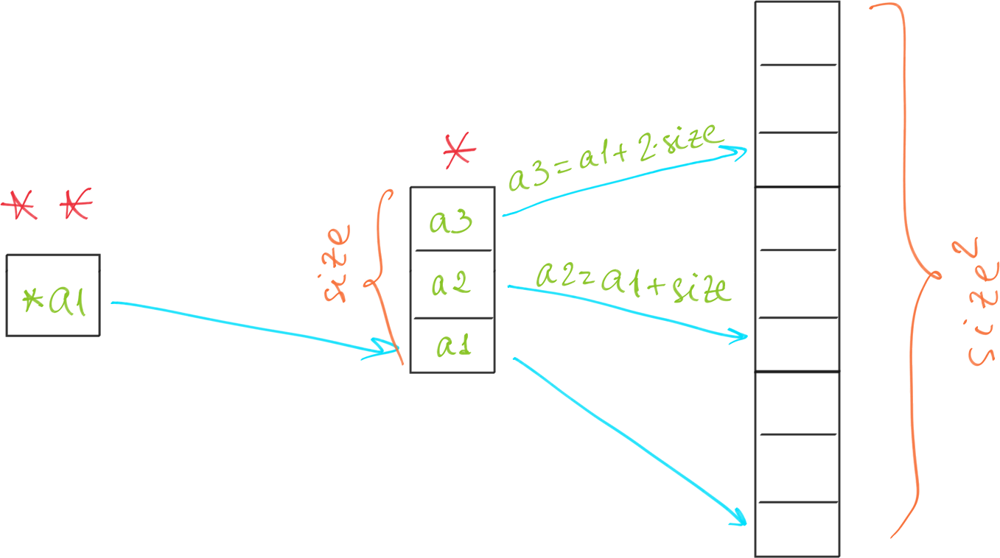

[//]: # (To preview markdown file in Emacs type C-c C-c p)

## Stack vs Heap

**Stack** is used for automatic memory allocation and **Heap** for dynamic memory allocation,
both stored in the computer's RAM.

Variables allocated on the **stack** are stored directly to the memory and access to
this memory is very fast, and it's allocation is dealt with when the program is
compiled.
The stack is always reserved in a LIFO order.
This makes it really simple to keep track of the stack, freeing a block from the
stack is nothing more than adjusting one pointer.
You can **use stack** if you know exactly how much data you need to allocate before
compile time and it is not too big.
To use it, define variables (without _static_ clause) within the scope of the
function (local scope).
When a function finishes running, all the variables associated with that function
on the stack are deleted, and the memory they use is freed up (hence the name
**automatic variables**).
If a program tries to put too much information on the stack, **stack overflow**
will occur.
Stack overflow happens when all the memory in the stack has been allocated, and
further allocations begin overflowing into other sections of memory.
Stack overflow also occurs in situations where recursion is incorrectly used.

Variables allocated on the **heap** have their memory allocated at run time and
accessing this memory is a bit slower, but the heap size is only limited by the
size of virtual memory.
Element of the heap have no dependencies with each other and can always be accessed
randomly at any time.
You can allocate a block at any time and free it at any time.
This makes it much more complex to keep track of which parts of the heap are
allocated or free at any given time.
Another performance hit for the heap is that the heap, being mostly a global
resource, typically has to be **multi-threading safe**, i.e. each allocation
and deallocation needs to be - typically - synchronized with "all" other heap
accesses in the program. 
You can **use heap** if you don't know exactly how much data you will need at runtime
or if you need to allocate a lot of data.
This is memory that is not automatically managed (unlike stack) – you have to
explicitly allocate (using functions such as `malloc()`), and deallocate
(e.g. `free()`) the memory.
Heap memory requires you to use **pointers** to access it.
Failure to free the memory when you are finished with it will result in what is
known as a **memory leak** – memory that is still “being used”, and not available
to other processes. 

In a **multi-threaded** situation each thread will have its own completely independent
stack but they will share the heap.
Stack is thread specific and heap is application specific.
The stack is important to consider in exception handling and thread executions.

There is a 3rd type of memory called **static**. 
Static memory persists throughout the entire life of the program, and is usually
used to store things like global variables, or variables created with the _static_ clause.

### Testing stack allocation
The program failed when the size of the array was set to 10e6, reporting a segmenation
fault.
The storage size for `int` is 4 bytes.
This results in 4 * 10e6 / 1024 / 1024 ~= 38 MB.
Running `ulimit -s` returns 8192 KB ~= 8 MB, which is smaller than the requested
amout of memory for allocation.

### Testing heap allocation
In C, dynamic memory is allocated from the heap using some standard library functions.
The two key dynamic memory functions are `malloc()` and `free()` (available through
`stdlib`).
The `malloc()` function takes a single parameter, which is the size of the requested
memory area in bytes.
It returns a pointer to the allocated memory.
If the allocation fails, it returns NULL.
The `free()` function takes the pointer returned by `malloc()` and de-allocates the memory.
No indication of success or failure is returned.

The program does not longer fail for the size that triggered the segmentation fault.

## Memory fragmentation
There are a number of problems with dynamic memory allocation in a real time system. 
The behaviour of `malloc()` is unpredictable, as the time it takes to allocate memory
is extremely variable.
Such nondeterministic behavior is intolerable in real time systems.
Without great care, it is easy to introduce memory leaks into application code implemented
using `malloc()` and `free()`.
The situation when there is sufficient memory available, but not available
in one contiguous chunk that can satisfy the allocation, is called **memory fragmentation**.
There are two types of memory fragmentation:

- **external**: inability to use memory because free memory is divided into many small
blocks (contiguous areas of memory).
- **internal**: memory manager allocates more for each allocation than is actually requested.

To **prevent** memory fragmentation, first of all, use dynamic memory as little as possible.
In most cases, you can use static or automatic storage instead of allocating objects dynamically.
Secondly, try to allocate large chunks rather than small ones.
For example, instead of allocating a single object, allocate an array of objects at once,
and use these objects when they are needed.

The 1st given allocation pattern (see `memory_fragmentation.c`) can be illustrated as follows:

This scenario is undesirable since it leads to larger amount of smaller memory areas available
after deallocation.

On the contrary, the 2nd pattern (see `avoid_memory_fragmentation.c`) allocates a bigger chunk
of contiguous memory:

## References
1. [Differences between Stack and Heap](http://net-informations.com/faq/net/stack-heap.htm)
1. [MEMORY IN C – THE STACK, THE HEAP, AND STATIC](https://craftofcoding.wordpress.com/2015/12/07/memory-in-c-the-stack-the-heap-and-static/)
1. [Dynamic Memory Allocation and Fragmentation in C and C++](https://www.design-reuse.com/articles/25090/dynamic-memory-allocation-fragmentation-c.html)
1. [Preventing Memory Fragmentation](http://www.devx.com/tips/Tip/14060)
